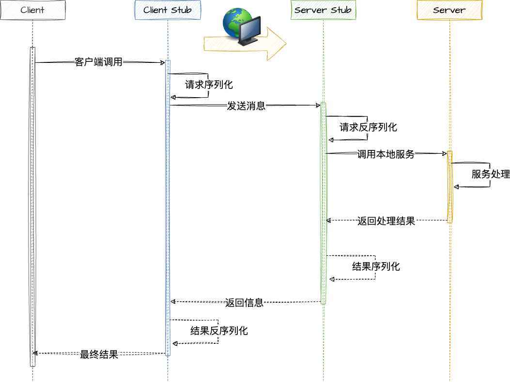

<h1 align="center">Easy RPC Framework</h1>
<p align="center">
  
  
  
  
   <br />
  
</p>
<hr>


## RPC Processing




## Document

- [PDD](./doc/pdd.md)
- [TDD](./doc/tdd.md)
- [Optimize](./doc/optimize.md)
- [TODO](./TODO.md)
- [Config File](./config/conf.example.properties)

## Quick Start

[Example 示例工程](./example)

```
.
├── example-common
├── example-consumer
├── example-provider
├── example-springboot-consumer
├── example-springboot-provider
```

- `example-common`：POJO、接口定义
- `example-provider` && `example-consumer`：配置代码驱动示例
- `example-springboot-provider` && `example-springboot-consumer`：注解驱动示例

启动流程：

1. 先启动注册中心：etcd、zookeeper、redis 皆可；
2. 修改配置：注册中心、项目监听端口、项目名称等等，`conf.properties`；
3. 启动生产者；
4. 启动消费者。

## Commit

如果需要提交新的代码，需要先执行根目录下的 `init.sh` 文件，该文件会注册一个 git hook，用于提交前的代码检测。