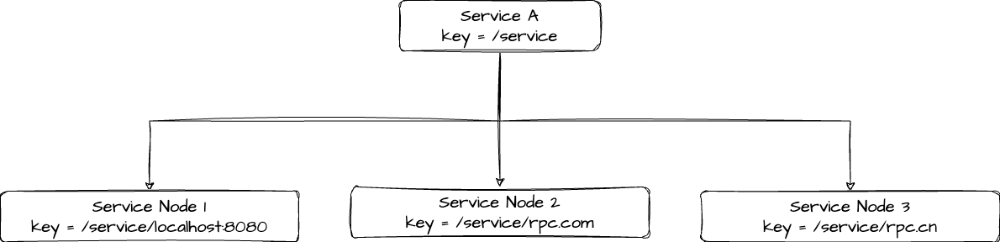
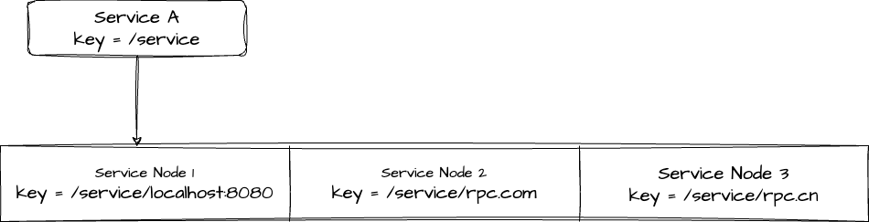

# 迭代优化-1

## 一、动态配置（全局配置加载）

### 需求背景

在 RPC 框架运行过程中，会涉及到很多配置信息，比如注册中心的地址、序列化方式、网络端口号等。再加上 RPC 框架是需要被其他项目作为服务提供者或者服务消费者引入的，我们应当允许框架的项目通过编写配置文件来**自定义配置**。一般情况下，服务提供者和服务消费者需要编写相同的 RPC 配置。

因此，我们需要维护一套全局配置加载功能，能够让 RPC 框架从配置文件中读取配置，并且维护一个全局配置对象，便于框架快速获取到一样的配置。

### 方案设计

#### 配置项梳理

开始时一切从简：

```properties
rpc.name=easy rpc test
rpc.host=localhost
rpc.port=8888
rpc.version=1.0.0
```

后期可以扩展，配置项参考：[Dubbo API 配置](https://cn.dubbo.apache.org/zh-cn/overview/mannual/java-sdk/reference-manual/config/api/)

#### 读取配置文件

1）配置文件类型：`properties`

2）使用 `Hutool#Props`

3）支持环境隔离

4）配置文件优先级：`conf/conf.properties` > `conf.properties`（相对于 classpath）

```java
/**
  * 加载配置
  * <p>
  * 优先加载 conf/conf.properties, 找不到再加载 conf.properties
  *
  * @param clazz  clazz
  * @param prefix properties common prefix
  * @param env    environment
  * @param <T>    T
  * @return props
  */
public static <T> T load(Class<T> clazz, String prefix, String env) {
    T props;
    try {
        props = loadProperties(clazz, "conf/conf", prefix, env);
    } catch (NoResourceException e) {
        log.warn("Not exists conf file in [conf/], will load file from classpath");
        props = loadProperties(clazz, "conf", prefix, env);
    }
    return props;
}
```

#### TODO 

- 配置分组 <= 通过嵌套配置类实现
- 动态更新配置对象 <= `props.autoLoad()`


## 二、Mock 接口

### 需求背景

为什么需要？RPC 框架的核心功能是调用其他远程服务。但是在实际开发和测试过程中，有时可能无法直接访问真实的远程服务，或者访问真实的远程服务可能会产生不可控的影响，比如网络延迟、服务不稳定等。在这种情况下，就需要使用 Mock 服务来模拟远程服务的行为，以便进行接口的测试、开发和调试。

### 方案设计

使用动态代理，创建一个**调用方法返回固定值**的对象。

```properties
rpc.mock=false
```


#### TODO

- 使用 Faker 类库 Mock 数据


## 三、序列化

### 需求背景

序列化器的作用：无论是请求还是响应，都会涉及到参数的传输。而 Java 对象是存活在  JVM 虚拟机中的，如果想在其他位置存储并访问、或者在网络中传输，就需要进行序列化和反序列化。

目前已经实现了基于 Java 原生序列化的序列化器，但是对于一个完善的 RPC 框架，还需要回答几个问题：

1. 有没有更好的序列化器实现方式？
2. 如何让使用框架的开发者指定使用序列化器？
3. 如何让使用框架的开发者自己定制序列化器？

### 方案设计

#### 常见的序列化实现方式

1）JSON

优点：

- 可读性好
- 语言支持广泛

缺点：

- 序列化后数据量较大
- 不能够很好的处理复杂的数据结构和循环引用，可能导致性能下降或者序列化失败

2）Hessian

优点：

- 二进制序列化，序列化后的数据量小，传输效率高
- 跨语言，适合在分布式系统中进行服务调用

缺点：

- 性能较 JSON 略低，因为需要将对象转换成二进制格式
- 对象必须要实现 Serializable 接口，限制了可序列化的对象范围

3）Kryo

优点：

- 高性能，序列化和反序列化速度快
- 支持循环引用和自定义序列化器，适用于复杂的对象结构
- 无需实现 Serializable 接口，可以序列化任意对象

缺点：

- 仅支持 Java
- 对象的序列化格式可读性差

4）Protobuf

优点：

- 高效、二进制序列化，序列化后的数据量小
- 跨语言支持
- 支持版本化和向前 / 向后兼容性

缺点：

- 配置相对复杂，需要先定义数据结构和消息格式
- 对象的序列化格式不易读懂，不便于调试

#### 动态使用序列化器

在使用序列化器时，根据配置来获取不同的序列化器。

#### 自定义序列化器

思路：RPC 框架能够读取到用户自定义的类路径，然后加载这个类，作为 Serializer 序列化接口的实现即可。

实现核心步骤：[Java SPI](https://pdai.tech/md/java/advanced/java-advanced-spi.html)

#### 自定义实现 SPI

1）指定 SPI 配置目录

- 系统内置 SPI: `META-INF/rpc/system`
- 用户自定义 SPI: `META-INF/rpc/custom`

2）自定义加载器

- 支持 `key=value`
- 用户目录优先级更高

3）支持懒加载

```java
public final class SerializerFactory {

    /**
     * 获取 Serializer
     *
     * @param key key
     * @return serializer
     */
    public static Serializer getSerializer(String key) {
        Serializer serializer;
        try {
            serializer = SpiLoader.getInstance(Serializer.class, key);
        } catch (NoSuchLoadClassException e) {
            init();
            serializer = SpiLoader.getInstance(Serializer.class, key);
        }
        return serializer;
    }

    public synchronized static void init() {
        SpiLoader.load(Serializer.class);
    }
}

// SpiLoader
public static <T> T getInstance(Class<T> loadClazz, String key) {
    String loadClazzName = loadClazz.getName();
    Map<String, Class<?>> keyImplClassMap = LOADER_MAP.get(loadClazzName);
    if (Objects.isNull(keyImplClassMap)) {
        throw new NoSuchLoadClassException(
            String.format("SpiLoader don't load %s,", loadClazz));
    }
    if (!keyImplClassMap.containskey(key)) {
        throw new NoSuchkeyException(
            String.format("%s has no key=%s impl class type,", loadClazz, key));
    }
    // ...
}
```


## 四、注册中心

### 需求背景

注册中心是 RPC 框架的一个核心模块，目的是帮助服务消费者获取到服务提供者的调用地址，而不是将调用地址硬编码到项目中。


### 方案设计

#### 注册中心的核心能力

1. 数据分布式存储：集中的注册信息数据存储、读取和共享
2. 服务注册：服务提供者上报服务信息到注册中心
3. 服务发现：服务消费者从注册中心拉取服务信息
4. 心跳检测：定期检查服务提供者的存活状态
5. 服务注销：手动剔除节点、或者自动剔除失效节点
6. 容错、缓存、……

#### 技术选型

根据核心能力进行选型。

**数据分布式存储**是最重要的，此外还需要有数据过期、数据监听的能力。在此基础上，考虑性能、高**可用性**、高**可靠性**、稳定性、数据一致性、社区生态和活跃度。

主流的注册中心中间件：

- Zookeeper
- Redis
- Etcd ✅
- ……

> ### Etcd
>
> Etcd 是一个 Go 语言实现的、开源的、分布式 的键值存储系统，它主要用于分布式系统中的服务发现、配置管理和分布式锁等场景。Etcd 采用 [Raft 一致性算法](https://en.wikipedia.org/wiki/Raft_(algorithm))来保证数据的一致性和可靠性，具有高可用性、强一致性、分布式特性等特点。
>
> #### Etcd 数据结构
>
> 1）key：Etcd 中的基本数据单元，类似于文件系统中的文件名。每个键都唯一标识一个值，并且可以包含子键，形成类似于路径的层次结构；「etcd 中的每个键都有一个与之关联的版本号，用于跟踪键的修改历史」
>
> 2）Value：与键关联的数据，可以是任意类型的数据，通常是字符串形式。
>
> #### 核心特性
>
> **1）Lease（租约）**：用于对键值对进行 TTL 超时设置，即设置键值对的过期时间。当租约过期时，相关的键值对将被自动删除；
>
> **2）Watch（监听）：**可以监视特定键的变化，当键的值发生变化时，会触发相应的通知。
>
> 
>
> #### 安装
>
> - [Etcd](https://etcd.io/docs/v3.5/install/)
> - [EtcdKeeper](https://github.com/evildecay/etcdkeeper)
>
> #### 了解 Raft In Etcd
>
> - http://play.etcd.io/play
>
> 
>
> #### Etcd Java 客户端
>
> [jetcd](https://github.com/etcd-io/jetcd)
>
> 📢注意：需要 JDK11+
>
> 1. **kvClient**：用于对 etcd 中的键值对进行操作。通过 kvClient 可以进行设置值、获取值、删除值、列出目录等操作；
> 2. **leaseClient**：用于管理 etcd 的租约机制。租约是 etcd 中的一种时间片，用于为键值对分配生存时间，并在租约到期时自动删除相关的键值对。通过 leaseClient 可以创建、获取、续约和撤销租约；
> 3. **watchClient**：用于监视 etcd 中键的变化，并在键的值发生变化时接收通知；
> 4. clusterClient：用于与 etcd 集群进行交互，包括添加、移除、列出成员、设置选举、获取集群的健康状态、获取成员列表信息等操作；
> 5. authClient：用于管理 etcd 的身份验证和授权。通过 authClient 可以添加、删除、列出用户、角色等身份信息，以及授予或撤销用户或角色的权限；
> 6. maintenanceClient：用于执行 etcd 的维护操作，如健康检查、数据库备份、成员维护、数据库快照、数据库压缩等；
> 7. lockClient：用于实现分布式锁功能，通过 lockClient 可以在 etcd 上创建、获取、释放锁，能够轻松实现并发控制；
> 8. electionClient：用于实现分布式选举功能，可以在 etcd 上创建选举、提交选票、监视选举结果等。


#### 存储结构设计

存储结构设计的几个要点：

1. key 的设计
2. Value 的设计
3. key 的过期时间

由于一个服务可能有多个服务提供者（负载均衡），此处可以有两种结构设计：

1）层级结构。将服务理解为文件夹、将服务对应的多个节点理解为文件夹下的文件，那么可以通过服务名称，用前缀查询的方式查询到某个服务的所有节点。

【🌰栗子】

键名的规则可以是 `/业务前缀/服务名/服务节点地址`：



2）列表结构。将所有的服务节点以列表的形式整体作为 Value，即服务为 key 其节点整体为 Value。

【🌰栗子】



> 选择哪种存储结构呢？

这个跟技术选型有关。对于 ZooKeeper 和 Etcd 这种支持层级查询的中间件，**用第一种结构会更清晰；**对于 Redis，由于本身就支持列表数据结构，可以选择第二种结构。

最后，一定要**给 key 设置过期时间**，比如默认 30 秒过期，这样如果服务提供者宕机了，也可以超时后自动移除。


#### 具体实现细节

抽象接口：

```java
public interface Registry {


    /**
     * 注册中心初始化
     *
     * @param config registry config
     */
    void init(RegistryConfig config);

    /**
     * 服务端注册服务
     *
     * @param metadata 服务元信息
     */
    void register(ServiceMetadata metadata) throws Exception;

    /**
     * 服务端注销服务
     *
     * @param metadata 服务元信息
     */
    void deregister(ServiceMetadata metadata);

    /**
     * 消费端获取某服务的所有节点，服务发现
     *
     * @param serviceKey 服务键
     * @return 某服务下的所有服务节点元信息
     */
    List<ServiceMetadata> discovery(String serviceKey);


    /**
     * 注册中心销毁
     */
    void destroy();

}
```

最后，也是可以利用自定义 SPI 实现注册中心的扩展（同 Serializer）。
