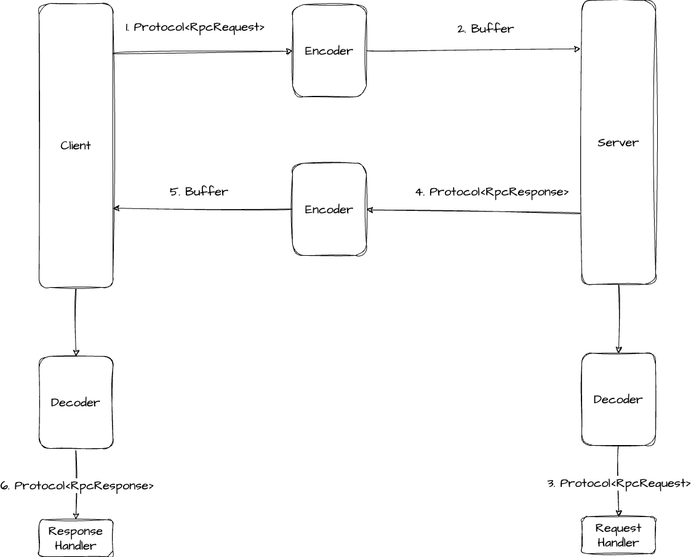

# 迭代优化-2

## 一、自定义协议

### 需求背景

目前的 RPC 框架，底层网络传输使用的是 HTTP 协议，有没有更好的选择呢？

一般情况下，RPC 框架会比较注重性能，而 HTTP 协议中的头部信息、请求响应格式会比较重，会影响网络传输。

所以需要自定义一套 RPC 协议，比如利用 TCP 等传输层协议，自定义请求响应结构，来实现性能更高、更灵活、更安全的 RPC 框架。

### 方案设计

自定义 RPC 协议可以分为两大核心部分：

- 自定义网络传输
- 自定义消息结构

#### 网络传输设计

**目标**：选择一个能够高性能通信的网络协议和传输方式。

HTTP 协议的头信息是比较重的，会影响传输性能；除此之外，HTTP 本身属于无状态协议，这意味着每个 HTTP 请求都是独立的，每次请求 / 响应都需要重新建立 / 关闭连接，也会影响性能。当然，在 HTTP/1.1 中引入了 Keep-Alive 机制，允许在单个 TCP 连接上发送多个 HTTP 请求和响应，避免了每次请求都要重新建立和关闭连接的开销，但是还是会发生「响应队头阻塞」的问题。

因此，为了追求更高的性能，还是选择使用 TCP 协议完成网络传输，有更多自主的设计空间。

> 也可以使用 UDP + QUIC协议实现，性能更高。

#### 消息结构设计

**目标**：用**最少的空间**传递**需要的信息**。

1）如何使用最少的空间？

尽可能使用更轻量的类型，比如 `byte`，甚至是 `bit`。

2）消息内需要哪些信息？

1. 魔数 (magic)：用于安全校验，防止服务器处理了非框架发来的乱七八糟的消息，类似 HTTPS 的安全证书；
2. 版本号 (version)：保证请求和响应的一致性，类似 HTTP 协议有 1.0/2.0 等版本；
3. 序列化方式 (serializer)：来告诉服务端和客户端如何解析数据，类似 HTTP 的 Content-Type 内容类型；
4. 类型 (type)：标识是请求还是响应，或者是心跳检测等其他用途，类似 HTTP 有请求头和响应头；
5. 状态 (status)：如果是响应，记录响应的结果，类似 HTTP 的 200 状态代码；
6. 请求 id (reqId)：唯一标识某个请求，因为 TCP 是双向通信的，需要有个唯一标识来追踪每个请求；
7. 请求体数据长度 (bodyLength)：保证能够完整地获取 body 内容信息，TCP 协议本身会存在**半包和粘包**问题，每次传输的数据可能是不完整的。


实际上，这些数据应该是**紧凑**的，请求头信息总长为 17 byte，即上述消息结构本质上就是拼接在一起的一个**字节数组**。后续实现时，需要有**消息编码器 / 消息解码器**，编码器先创建一个空的 Buffer 缓冲区，然后按照顺序向缓冲区依次写入这些数据；解码器在读取时也按照**顺序**依次**读取**，就能够还原出编码前的数据。




### 粘包半包问题解决

- 半包：接受到的数据少了
- 粘包：接收到的数据多了

#### 如何解决粘包？

解决粘包和半包的核心思路也是类似的：**每次只读取指定长度的数据，超过长度的留着下一次接收到消息时再读取**。


解决思路：将读取完整的消息拆分为2次：

1. 先完整读取请求头信息，由于请求头信息长度是固定的，可以使用 `Vertx.RecordPraser` 保证每次都完整读取；
2. 再根据请求头长度信息更改 `RecordParser` 的固定长度，保证完整获取到请求体。

```java
private RecordParser initRecordParser(Handler<Buffer> bufferHandler) {
    // 构造 Parser
    RecordParser parser = RecordParser.newFixed(ProtocolConstant.MESSAGE_HEADER_LENGTH);

    parser.setOutput(new Handler<>() {
        // 初始化
        int size = -1;
        // 一次性完整地读取（头 + 体）
        Buffer resultBuffer = Buffer.buffer();

        @Override
        public void handle(Buffer buffer) {
            if (-1 == size) {
                // 读取消息体长度
                size = buffer.getInt(ProtocolConstant.BODY_LEN_POS);
                parser.fixedSizeMode(size);
                // 写入头信息
                resultBuffer.appendBuffer(buffer);
            } else {
                // 写入消息体
                resultBuffer.appendBuffer(buffer);
                bufferHandler.handle(resultBuffer);

                // 重置一轮
                parser.fixedSizeMode(ProtocolConstant.MESSAGE_HEADER_LENGTH);
                size = -1;
                resultBuffer = Buffer.buffer();
            }
        }
    });

    return parser;
}
```

具体实现时，使用**装饰者模式**，使用 `RecordParser` 对原有的 `Buffer` 处理器的能力进行增强。


## 二、负载均衡

### 需求背景

当客户端发起请求时，选择一个服务提供者发起请求，而不是每次都请求同一个服务提供者，这个操作就叫做 **负载均衡**。

> 参考：[什么是负载均衡？](https://www.codefather.cn/%E4%BB%80%E4%B9%88%E6%98%AF%E8%B4%9F%E8%BD%BD%E5%9D%87%E8%A1%A1/)

#### 常见负载均衡算法

1）**轮询 (Round Robin)**：按照循环的顺序将请求分配给每个服务器，适用于各服务器性能相近的情况；

2）**随机 (Random)**：随机选择一个服务器来处理请求，适用于服务器性能相近且负载均匀的情况；

3）**加权轮询 (Weighted Round Robin)**：根据服务器的性能或权重分配请求，性能更好的服务器会获得更多的请求，适用于服务器性能不均的情况；

4）**加权随机 (Weighted Random)**：根据服务器的权重随机选择一个服务器处理请求，适用于服务器性能不均的情况；

5）**最小连接数 (Least Connections)**：选择当前连接数最少的服务器来处理请求，适用于长连接场景；

6）**IP Hash**：根据客户端 IP 地址的哈希值选择服务器处理请求，确保同一客户端的请求始终被分配到同一台服务器上，适用于需要保持会话一致性的场景。

> 一致性 Hash 参考：[一致性哈希算法分区](https://www.codejuzi.icu/docs/46902.html)

### 方案设计

通过 SPI 机制，支持配置和扩展负载均衡器

1）引入负载均衡器工厂 `LoadBalancer`

2）使用工厂模式 `LoadBalancerFactory`

实现算法：

- Round Robin
- Random
- ConsistentHash


## 三、重试机制

### 需求背景

目前，如果使用 RPC 框架的服务消费者调用接口失败，就会直接报错。

调用接口失败可能有很多原因，有时可能是服务提供者返回了错误，但有时可能只是网络不稳定或服务提供者重启等临时性问题。这种情况下，我们可能更希望服务消费者拥有自动重试的能力，提高系统的可用性。

### 方案设计

#### 重试策略

1. 什么时候、什么条件下重试？
2. 重试时间？
3. 什么时候、什么条件下停止重试？
4. 重试后要做什么？

#### 重试条件

希望提高系统的可用性，当由于网络等异常情况发生时，触发重试。

#### 重试时间算法

1）固定重试间隔 `(Fixed Retry Interval)`：在每次重试之间使用固定的时间间隔；

2）指数退避重试 (`Exponential Backoff Retry`)：在每次失败后，重试的时间间隔会以指数级增加，以避免请求过于密集；

3）随机延迟重试 (`Random Delay Retry`)：在每次重试之间使用随机的时间间隔，以避免请求的同时发生；

4）可变延迟重试 (`Variable Delay Retry`)：这种策略更「高级」，根据先前重试的成功或失败情况，动态调整下一次重试的延迟时间。比如，根据前一次的响应时间调整下一次重试的等待时间。

> 值得一提的是，以上的策略是可以组合使用的，一定要根据具体情况和需求灵活调整。比如可以先使用指数退避重试策略，如果连续多次重试失败，则切换到固定重试间隔策略。

#### 停止重试

一般来说，重试次数是有上限的，否则随着报错的增多，系统同时发生的重试也会越来越多，造成雪崩。

主流的停止重试策略有：

1）最大尝试次数：一般重试当达到最大次数时不再重试；

2）超时停止：重试达到最大时间的时候，停止重试。

#### 重试工作

最后一点是重试后要做什么事情？一般来说就是重复执行原本要做的操作，比如发送请求失败了，那就再发一次请求。

需要注意的是，当重试次数超过上限时，往往还要进行其他的操作，比如：

1）通知告警：让开发者人工介入；

2）降级容错：改为调用其他接口、或者执行其他操作。

#### 重试方案设计

1）使用 `guava-retrying`；

2）可以将 `VertxTcpClient.doRequest` 封装为一个可重试的任务，如果请求失败（重试条件），系统就会自动按照重试策略再次发起请求，不用开发者关心；

3）实现策略：

- 不重试
- 固定时间间隔
- 指数退避

4）使用 SPI 机制，实现可配置和可扩展

## 四、容错机制

### 需求背景

服务消费者调用服务失败后，一定要重试嘛？可以尝试另一种提高服务消费端可靠性和健壮性的机制——容错机制。

### 方案设计

#### 容错机制

容错是指系统在出现异常情况时，可以通过一定的策略保证系统仍然稳定运行，从而提高系统的可靠性和健壮性。

在分布式系统中，容错机制尤为重要，因为分布式系统中的各个组件都可能存在网络故障、节点故障等各种异常情况。要顾全大局，尽可能消除偶发 / 单点故障对系统带来的整体影响。比如，将分布式系统类比为一家公司，如果公司某个优秀员工请假了，需要 「触发容错」，让另一个普通员工顶上，这本质上是容错机制的一种 **降级** 策略。

#### 容错策略

1）`Fail-Over` 故障转移：一次调用失败后，切换一个其他节点再次进行调用，也算是一种重试；

2）`Fail-Back` 失败自动恢复：系统的某个功能出现调用失败或错误时，通过其他的方法，恢复该功能的正常。可以理解为降级，比如重试、调用其他服务等；

3）`Fail-Safe` 静默处理：系统出现部分非重要功能的异常时，直接忽略掉，不做任何处理，就像错误没有发生过一样；

4）`Fail-Fast` 快速失败：系统出现调用错误时，立刻报错，交给外层调用方处理。

#### 容错实现方式

1）重试：重试本质上也是一种容错的降级策略，系统错误后再试一次；

2）限流：当系统压力过大、已经出现部分错误时，通过限制执行操作（接受请求）的频率或数量，对系统进行保护；

3）降级：系统出现错误后，改为执行其他更稳定可用的操作。也可以叫做 「兜底」 或 「有损服务」，这种方式的本质是：即使牺牲一定的服务质量，也要保证系统的部分功能可用，保证基本的功能需求得到满足；

4）熔断：系统出现故障或异常时，暂时中断对该服务的请求，而是执行其他操作，以避免连锁故障；

5）超时控制：如果请求或操作长时间没处理完成，就进行中断，防止阻塞和资源占用；

在实际项目中，根据对系统可靠性的需求，通常会结合多种策略或方法实现容错机制。


#### 容错方案设计

1）先容错再重试：当系统发生异常时，首先会触发容错机制，比如记录日志，告警等，然后可以选择是否进行重试；

> 这种方案其实是把重试当做容错的一种可选方案。

2）先重试再容错：当系统发生异常时，先尝试重试操作，如果重试多次仍然失败，则触发容错机制，比如记录日志、告警等。

两种方案其实可以结合使用，系统错误时，可以先通过重试机制解决一些临时性的异常，比如网络波动、服务端临时不可用等；如果重试多次后仍然失败，说明可能存在更严重的问题，此时可以触发其他的容错策略，比如调用降级服务、熔断、限流、快速失败等等，来减少异常的影响，保障系统的稳定性和可靠性。

【🌰栗子】

1. 系统调用服务 A 出现网络错误，使用容错机制 —— 重试；
2. 重试 3 次失败后，使用其他容错策略 —— 降级；
3. 系统改为调用不依赖网络的服务 B，完成操作。


具体实现时，使用 SPI 机制，实现可配置和可扩展。

```java
public interface TolerantStrategy {


    /**
     * 容错
     *
     * @param context 上下文
     * @param e       异常
     * @return RpcResponse
     */
    RpcResponse tolerant(Map<String, Object> context, Exception e) throws Exception;

}
```

使用容错机制：

```java
RpcResponse rpcResponse;
try {
    // 重试机制
    RetryStrategy retryStrategy = RetryStrategyFactory.getRetryStrategy(
        RpcApplication.resolve().getRetry());
    // 发送 TCP 请求
    rpcResponse = retryStrategy.retry(
        () -> VertxTcpClient.doRequest(rpcRequest, selectedService));
} catch (Exception e) {
    // 容错上下文
    Map<String, Object> context = new HashMap<>() {{
        put("serviceMetadataList", serviceMetadataList);
        put("errorService", selectedService);
        put("rpcRequest", rpcRequest);
    }};
    // 容错机制
    TolerantStrategy tolerantStrategy = TolerantStrategyFactory.getTolerantStrategy(
        RpcApplication.resolve().getTolerant());
    rpcResponse = tolerantStrategy.tolerant(context, e);
}
return rpcResponse.getData();
```

## 五、启动机制

### 需求背景

让用户更快上手。

### 方案设计

#### 启动机制设计

把所有启动代码封装成一个专门的**启动类**或者方法，然后由服务提供者 / 服务消费者来调用即可。

```java
public class ProviderBootstrap {

    public static void init(List<ServiceRegisterInfo<?>> serviceRegisterInfoList) {
        // RPC 框架初始化（配置、注册中心）
        RpcApplication.init();
        // 全局配置
        final ApplicationConfig applicationConfig = RpcApplication.resolve();
        // 获取注册中心
        RegistryConfig registryConfig = applicationConfig.getRegistry();
        Registry registry = RegistryFactory.getRegistry(registryConfig.getRegistry());

        // 注册服务
        for (ServiceRegisterInfo<?> serviceRegisterInfo : serviceRegisterInfoList) {
            String serviceName = serviceRegisterInfo.getServiceName();
            Class<?> implClass = serviceRegisterInfo.getImplClass();

            // 本地注册
            LocalRegistry.registry(serviceName, implClass);

            ServiceMetadata serviceMetadata = new ServiceMetadata();
            serviceMetadata.setServiceName(serviceName);
            serviceMetadata.setServiceHost(applicationConfig.getHost());
            serviceMetadata.setServicePort(applicationConfig.getPort());

            try {
                // 注册到注册中心
                registry.register(serviceMetadata);
            } catch (Exception e) {
                throw new RuntimeException("register service failed", e);
            }
        }

        // 启动 Provider Web 服务
        RpcServer rpcServer = new VertxTcpServer();
        rpcServer.doStart(applicationConfig.getPort());

    }
}
```

```java
public class ConsumerBootstrap {

    public static void init() {
        // RPC 框架初始化
        RpcApplication.init();
    }

}
```

## 六、注解驱动

### 需求背景

几个注解即可使用 RPC 框架，比如 Dubbo 的 `@EnableDubbo`、 `@DubboService`、`@DubboReference`。使用更简便。

### 方案设计

#### 实现注解驱动的常见方式

1. 主动扫描：让开发者指定要扫描的路径，然后遍历所有的类文件，针对有注解的类文件，执行自定义的操作；
2. 监听 Bean 加载：在 Spring 项目中，可以通过实现 `BeanPostProcessor` 接口，在 Bean 初始化后执行自定义的操作。

#### 定义注解

参考 Dubbo 的注解

1. `@EnableDubbo`：在 Spring Boot 主应用类上使用，用于启用 Dubbo 功能。
2. `@DubboComponentScan`：在 Spring Boot 主应用类上使用，用于指定 Dubbo 组件扫描的包路径。
3. `@DubboReference`：在消费者中使用，用于声明 Dubbo 服务引用。
4. `@DubboService`：在提供者中使用，用于声明 Dubbo 服务。
5. `@DubboMethod`：在提供者和消费者中使用，用于配置 Dubbo 方法的参数、超时时间等。
6. `@DubboTransported`：在 Dubbo 提供者和消费者中使用，用于指定传输协议和参数，例如传输协议的类型、端口等。

本次实现遵循最小可用化原则，我们只需要定义 3 个注解

1）`@EnableRpc`：用于全局标识项目需要引入 RPC 框架、执行初始化方法。由于服务消费者和服务提供者初始化的模块不同，我们需要在 EnableRpc 注解中，指定是否需要启动服务器等属性。

2）`@RpcService`：服务提供者注解，在需要注册和提供的服务类上使用。`@RpcService` 注解中，需要指定服务注册信息属性，比如服务接口实现类、版本号、服务名称等；

3）`@RpcReference`：服务消费者注解，在需要注入服务代理对象的属性上使用，类似 Spring 中的 `@Resource` 注解。

#### 获取注解的属性

实现 `Spring` 的 `ImportBeanDefinitionRegistrar `接口，并且在 `registerBeanDefinitions` 方法中，获取到项目的注解和注解属性。

```java
@Slf4j
public class RpcInitBootStrap implements ImportBeanDefinitionRegistrar {

    @Override
    public void registerBeanDefinitions(@NonNull AnnotationMetadata importingClassMetadata,
            @NonNull BeanDefinitionRegistry registry) {
        // 获取 @EnableRpc 注解的属性值
        boolean needServer = (boolean) Objects.requireNonNull(
                        importingClassMetadata.getAnnotationAttributes(EnableRpc.class.getName()))
                .get("needServer");

        // RPC 框架初始化
        RpcApplication.init();

        // 全局配置
        final Config applicationConfig = RpcApplication.resolve();

        if (needServer) {
            // 启动 服务器
            RpcServer rpcServer = new VertxTcpServer();
            rpcServer.doStart(applicationConfig.getPort());
        }
    }
}
```

#### 获取到包含注解的类属性（自动注入）

实现 `BeanPostProcessor `接口的 `postProcessAfterInitialization `方法，就可以在某个服务提供者 Bean 初始化后，执行注册服务等操作了。

```java
@Slf4j
public class RpcConsumerBootStrap implements BeanPostProcessor {

    @Override
    public Object postProcessAfterInitialization(@NonNull Object bean, @NonNull String beanName)
            throws BeansException {
        Class<?> beanClazz = bean.getClass();
        // 遍历对象的所有属性
        Field[] declaredFields = beanClazz.getDeclaredFields();
        for (Field field : declaredFields) {
            RpcReference rpcReference = field.getAnnotation(RpcReference.class);
            if (rpcReference == null) {
                continue;
            }
            // 为属性生成代理对象
            Class<?> interfaceClass = rpcReference.interfaceClass();
            if (interfaceClass == void.class) {
                interfaceClass = field.getType();
            }

            field.setAccessible(true);

            Object proxy = ServiceProxyFactory.getProxy(interfaceClass);

            try {
                field.set(bean, proxy);
                field.setAccessible(false);
            } catch (IllegalAccessException e) {
                throw new RuntimeException("failed to set rpc proxy in field: " + field.getName(),
                        e);
            }
        }
        return BeanPostProcessor.super.postProcessAfterInitialization(bean, beanName);
    }
}
```

```java
@Slf4j
public class RpcProviderBootStrap implements BeanPostProcessor {

    @Override
    public Object postProcessAfterInitialization(@NonNull Object bean, @NonNull String beanName)
            throws BeansException {
        Class<?> beanClazz = bean.getClass();
        RpcService rpcService = beanClazz.getAnnotation(RpcService.class);
        // 需要注册服务
        if (rpcService != null) {
            // 1. 获取服务基本信息
            Class<?> interfaceClass = rpcService.interfaceClass();
            // 默认值处理
            if (interfaceClass == void.class) {
                interfaceClass = beanClazz.getInterfaces()[0];
            }

            String serviceName = interfaceClass.getName();
            String serviceVersion = rpcService.serviceVersion();

            // 全局配置
            final Config applicationConfig = RpcApplication.resolve();
            // 获取注册中心
            RegistryConfig registryConfig = applicationConfig.getRegistry();
            Registry registry = RegistryFactory.getRegistry(registryConfig.getRegistry());

            // 2. 注册服务
            LocalRegistry.registry(serviceName, beanClazz);

            ServiceMetadata serviceMetadata = new ServiceMetadata();
            serviceMetadata.setServiceName(serviceName);
            serviceMetadata.setServiceHost(applicationConfig.getHost());
            serviceMetadata.setServicePort(applicationConfig.getPort());
            serviceMetadata.setServiceVersion(serviceVersion);

            try {
                // 注册到注册中心
                registry.register(serviceMetadata);
            } catch (Exception e) {
                throw new RuntimeException("register service failed", e);
            }
        }
        return BeanPostProcessor.super.postProcessAfterInitialization(bean, beanName);
    }
}
```


#### 启动类注解

```java
@Target({ElementType.TYPE})
@Retention(RetentionPolicy.RUNTIME)
@Import({RpcInitBootStrap.class, RpcProviderBootStrap.class, RpcConsumerBootStrap.class})
public @interface EnableRpc {

    /**
     * @return 是否需要开启 Server
     */
    boolean needServer() default true;
}
```

引入 `@EnableRpc`时，将`RpcInitBootstrap`、`RpcProviderBootstrap` 和`RpcConsumerBootstrap` 这三个类导入到 Spring 的上下文中。这三个类可能包含了一些重要的配置信息、Bean 定义或者其他初始化逻辑，它们对于 RPC 框架的初始化和运行至关重要。