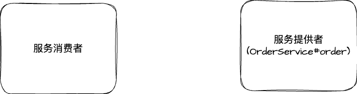
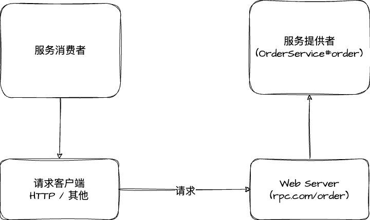
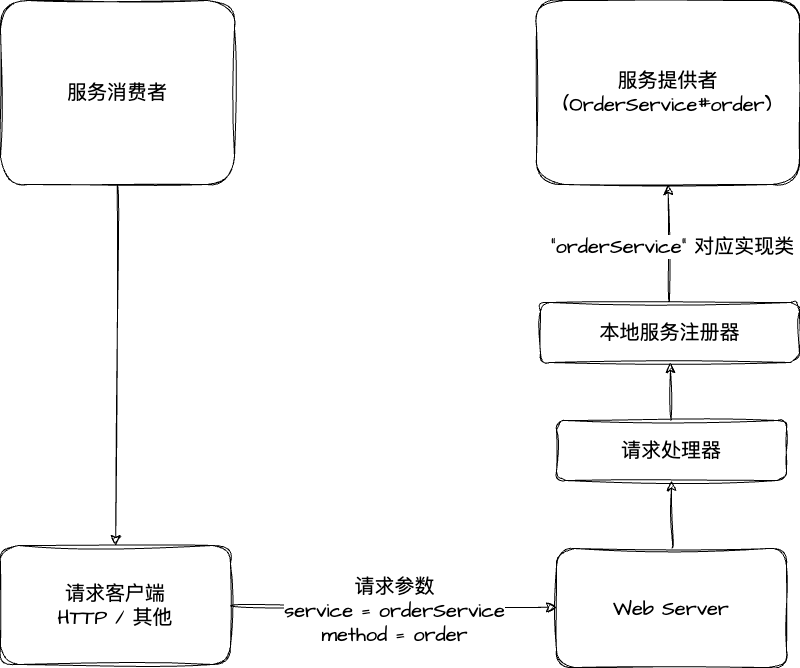
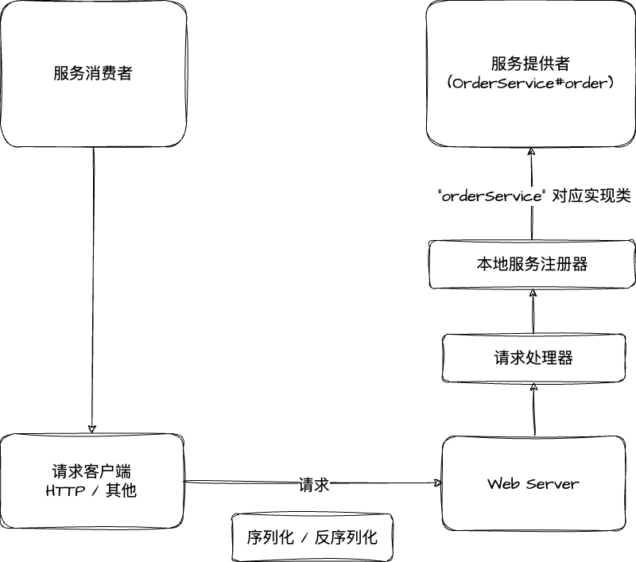
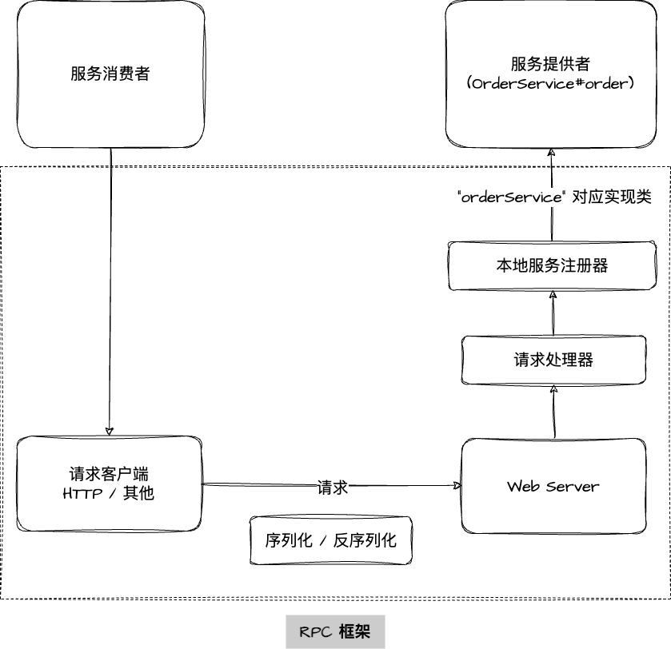
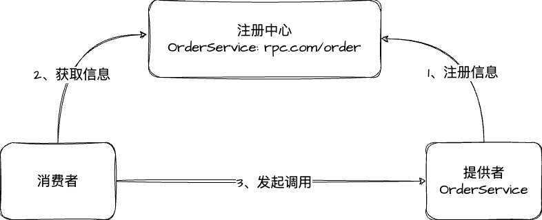

# 一、基本概念

## 什么是 RPC ?

专业定义：RPC, Remote Procedure Call, 即远程过程调用，是一种计算机通信协议。它允许运行于一台计算机的程序调用另一台计算机的子程序，而程序员无需额外地为这个交互作用编程。如果涉及的软件使用了 RPC，那么它通常被称为是远程过程调用。

举个生活中的例子，附近新开了一家熟食店，现在你作为消费者想要把喜欢的食物送到店里。在没有 RPC 的时候，你只能自己去线下店购买，耗时耗力。但是现在有了
手机、网络、外卖平台（RPC），你只需要打开手机上的外卖 APP，输入地址、选择食物，然后等待外卖小哥送餐即可，并不需要关注整个过程中网络信息是如何传输的、外卖平台是如何操作的、骑手小哥是如何配送的，只负责享受食物就好了。

## 为什么需要 RPC ?

回到 RPC 的概念，RPC 允许一个程序（服务消费者）像调用自己程序的方法一样，调用另一个程序（服务提供者）的接口，而不需要了解数据的传输处理过程、底层网络通信的细节等，这些都会由 RPC 框架帮你完成，使得开发者可以轻松调用远程服务，快速开发**分布式**系统。

> 分布式系统是由多个独立的计算机节点组成的系统，这些节点通过网络相互连接并协同工作以完成共同的任务。分布式系统的设计旨在提高系统的性能、可伸缩性和容错性。

【🌰栗子】现有项目 A 提供了点餐服务，项目 B 需要调用点餐服务完成下单。

点餐服务接口的示例伪代码：

```java
interface OrderService {
    
    // 点餐，返回 orderId
    long order(arg1, arg2, arg3);
}
```

> 问题：如果没有 RPC 框架，项目 B 该如何调用项目 A 的服务呢？

首先，由于项目 A 和项目 B 都是独立的系统，不能够像 SDK 一样作为依赖包引入。那么就需要项目 A 提供 Web 服务，并且编写一个点餐接口暴露服务，比如访问 `http://rpc.com/order` 就能够调用点餐服务；然后项目 B 作为服务消费者，需要自己构造请求，并通过发送 HTTP 请求上述地址。如果项目 B 需要调用更多的第三方服务，每个服务和方法的调用都编写一个 HTTP 请求，那将会非常麻烦！

「HTTP 调用伪代码」

```java
String url = "http://rpc.com/order";
Req req = new Req(arg1, arg2, arg3);
Res res = http.post(url).body(req).execute();
long orderId = res.data.orderId;
```

但是现在有了 RPC，项目 B 可以通过一行代码就可以完成调用！

「RPC 调用伪代码」

```java
long orderId = orderService.order(arg1, arg2, arg3);
```

看上去就是在调用自己项目的方法！


# 二、RPC 框架实现思路

## 基本设计

> 问题：RPC 框架为什么能够帮助我们简化调用？如何实现一个 RPC 框架？

基础角色：「**服务消费者**」、「**服务提供者**」



服务消费者想要调用服务提供者，就需要启动一个 **web 服务**，然后通过**请求客户端** 发送 HTTP 请求或者其他协议的请求来调用。

比如请求 `rpc.com/order` 地址后，服务提供者就会调用 `OrderService#order()` 方法。



> 问题：但是如果服务提供者提供了多个服务和方法，难道每个接口和方法都要单独写一个接口吗？消费者要针对每个接口写一段 HTTP 调用的逻辑吗？

其实不用，可以提供一个统一的服务调用接口，然后交给**请求处理器**来处理，它会根据客户端的请求参数来进行不同的处理、调用不同的服务和方法。具体实现可以在服务提供者程序中维护一个**本地服务注册器**，记录服务和对应的实现类的映射。

【🌰栗子】消费者要调用 `OrderService#order()` 方法，可以发送请求，携带参数 `service=orderService, method=order`，然后请求处理器会根据 `service` 从服务注册器中找到对应的服务实现类，并通过 Java 的反射机制调用 method 指定的方法。



📢需要注意的是，由于 Java 对象无法直接在网络中传输，所以要对传输的参数进行**序列化**和**反序列化**。



除此之外，为了简化消费者发送请求的代码，实现类似本地调用的体验，可以基于**代理模式**，为消费者要调用的接口生成一个代理对象，由代理对象完成请求和响应的过程。

至此我们就完成了一个最简易的 RPC 框架架构图：



上图中的虚线框部分，就是 RPC 框架需要提供的模块和能力。


## 扩展设计

> 虽然上述的设计已经跑通了基本调用流程，但是离一个完备的 RPC 框架还有很大的差距，还存在一些问题。

### 1、服务注册发现

> 问题一：服务消费者如何知道服务提供者的调用地址呢？

类似的场景在生活中也有，我们在点外卖的时候，骑手小哥如何知道我们的地址和店铺的地址呢？肯定是买家和卖家分别填写地址，然后交由平台来保存的。

因此，我们需要一个**注册中心**，来保存服务提供者的地址。消费者需要调用服务时，只需要从注册中心获取对应服务提供者的地址即可。



### 2、负载均衡

> 问题二：如果有多个服务提供者，消费者应该调用哪个服务提供者呢？

我们可以给服务调用方增加负载均衡能力，通过指定不同的算法来决定调用哪一个服务提供者的服务，比如轮询、随机、根据性能动态调整等。


### 3、容错机制

> 问题三：如果服务调用失败，应该如何处理呢？

为了保证分布式系统的高可用，我们通常会给服务的调用增加一定的容错机制，比如失败重试、降级调用其他接口等等。


### 4、其他

除了上面几个设计，如果想要做一个完善、优秀的 RPC 框架，还需要考虑很多问题，比如：

- 服务提供者下线了如何处理？需要一个失效节点剔除机制；
- 服务消费者每次都从注册中心拉取信息，对于性能有影响，可以使用缓存来优化性能；
- 如何优化 RPC 框架的传输通讯性能？比如选择合适的网络框架、自定义协议头、节约传输体积等等；
- 如何让整个框架更利于扩展？比如利用 Java 的 SPI 机制、配置化等等；
- 心跳机制；
- ……

