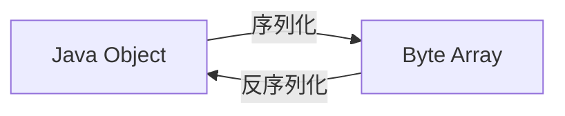

# Easy Rpc 1.0 TDD

「架构设计图」


根据上述架构图，我们需要完成的部分包括：

- Web Server 以及 对应的请求处理器
- 本地服务注册器
- 序列化/反序列化器
- 代理


## Web Server

作为服务的提供方，需要提供**可以远程访问**的服务，那么就需要一个 Web Server，能够接受、处理、响应请求。

Web Server 的选择有很多，比如 Tomcat、Netty、Vert.x 等等，此处选择 Vert.x。

此外，此处定义一个统一的 Server 接口，定义统一的启动服务器方法，便于后续的扩展，比如变更服务器等等。

```java
public interface HttpServer {

    /**
     * 启动 web 服务器
     *
     * @param port 端口号
     */
    void doStart(int port);
}
```


## 本地服务注册器

Easy Rpc 第一版是以**理解思想、跑通流程**为主，所以暂时不考虑第三方注册中心，直将服务注册到服务提供者本地即可。

```java
/**
     * 注册信息存储
     */
private static final Map<String /* 服务名称 */, Class<?> /* 服务实现类 */> REGISTER_SERVICE_MAP = new ConcurrentHashMap<>();

```

之后就可以根据要调用的服务名称获取到对应的实现类，通过反射进行方法调用即可。

**本地服务注册器**和**注册中心**作用的区别：

1. 注册中心侧重于管理注册的服务、提供服务信息给消费者；
2. 本地服务注册器的作用是根据服务名获取到对应的实现类，是完成调用必不可少的模块。

> 何时注册？

服务提供者启动的时候，就需要将服务注册到注册器中。

```java
public class EasyProviderExample {

    public static void main(String[] args) {

        // 注册服务
        LocalRegistry.registry(UserService.class.getName(), UserServiceImpl.class);

        // 启动 Web 服务
        HttpServer httpServer = new VertxHttpServer();
        httpServer.doStart(8080);
    }
}
```


## 序列化器

服务注册以后，我们就可以根据请求信息取出对应的服务实现类调用方法了。

但是在正式请求之前，需要先实现序列化器模块，因为无论是请求还是响应，都会涉及到参数的传输，即 IO；而 Java 对象是存在在 JVM 中的，是以 class 字节码的形式存在的，如果想要在其他位置存储并访问、甚至于网络传输，就需要进行序列化和反序列化。



有很多种序列化方式，参考：https://javaguide.cn/java/basis/serialization.html

此处也是一样，抽象出一个统一的接口，便于后续拓展：

```java
public interface Serializer {

    /**
     * 序列化
     *
     * @param obj target object
     * @param <T> T
     * @return byte arr
     * @throws IOException io exception
     */
    <T> byte[] serialize(T obj) throws IOException;

    /**
     * 反序列化
     *
     * @param data  byte arr
     * @param clazz class type
     * @param <T>   T
     * @return target object
     * @throws IOException io exception
     */
    <T> T deserialize(byte[] data, Class<T> clazz) throws IOException;
}
```

这里为了实现方便，选择 JDK 原生序列化：

```java
public class JdkSerializer implements Serializer {
    @Override
    public <T> byte[] serialize(T obj) throws IOException {
        ByteArrayOutputStream bos = new ByteArrayOutputStream();
        ObjectOutputStream oos = new ObjectOutputStream(bos);
        oos.writeObject(obj);
        oos.close();
        return bos.toByteArray();
    }

    @Override
    @SuppressWarnings("unchecked")
    public <T> T deserialize(byte[] data, Class<T> clazz) throws IOException {
        ByteArrayInputStream bis = new ByteArrayInputStream(data);

        try (ObjectInputStream ois = new ObjectInputStream(bis)) {
            return (T) ois.readObject();
        } catch (ClassNotFoundException e) {
            throw new RuntimeException(e);
        }
    }
}
```


## 请求处理器

这一部分是 RPC 框架的实现关键、核心，它的作用是：处理接收到的请求，并根据请求参数找到对应的服务和方法，通过反射实现调用，最后封装返回结果并响应请求。

因此，这里需要**统一下请求和响应**：

```java
@Data
@Builder
@NoArgsConstructor
@AllArgsConstructor
public class RpcRequest implements Serializable {


    @Serial
    private static final long serialVersionUID = 1L;

    /**
     * 服务名称
     */
    private String serviceName;

    /**
     * 方法名称
     */
    private String methodName;

    /**
     * 参数类型列表
     */
    private Class<?>[] parameterTypes;

    /**
     * 参数列表
     */
    private Object[] parameters;
    
}
```

```java
@Data
@Builder
@NoArgsConstructor
@AllArgsConstructor
public class RpcResponse implements Serializable {

    @Serial
    private static final long serialVersionUID = 1L;

    /**
     * 响应数据
     */
    private Object data;

    /**
     * 响应数据类型
     */
    private Class<?> dataType;

    /**
     * 响应信息
     */
    private String message;

    /**
     * 异常信息
     */
    private Exception exception;

}
```

Web Server 选择的是 Vert.x，因此需要根据 Vert.x 的设计来实现自定义的请求处理器，参考：https://vertx-china.github.io/docs/vertx-core/java/#_handling_requests

> 在请求处理器中干什么？

1. 反序列化请求对象，从中获取到参数；
2. 根据参数中的服务名称从本地服务注册器中获取到对应的服务实现类；
3. 通过反射机制调用方法，得到返回结果；
4. 封装返回结果，进行序列化，写入响应。


## 代理

静态代理很简单，只需要实现服务对应的接口就好了，但是缺点就是我们需要给每个服务接口都写一个实现类，这是非常麻烦的，灵活性不够。

因此我们使用**动态代理**。

动态代理的作用：根据要生成对象的类型，自动生成一个代理对象。

常见的动态代理技术：

- JDK 动态代理：基于接口，无需引入额外的库
- CGLIB 动态代理：基于字节码，更灵活，可以对任何类做代理，需要引入 CGLIB 库

此处选择 JDK 动态代理。

在 JDK 动态代理中，很关键的一个接口就是`InvocationHandler`，代理类需要实现这个接口中的 `invoke` 方法，方法中做的就是代理发送请求。然后就是通过 `Proxy` 类获取代理类，一般的方式是创建一个代理工厂：

```java
@SuppressWarnings("unchecked")
public static <T> T getProxy(Class<?> serviceClazz) {
    return (T) Proxy.newProxyInstance(
        serviceClazz.getClassLoader(),
        new Class[]{serviceClazz},
        new ServiceProxy()
    );
}
```

然后在消费者方就可以使用代理工厂获取相应的代理类了。

```java
private static UserService getUserService() {
    return ServiceProxyFactory.getProxy(UserService.class);
}
```


## 执行验证

> 额外提一嘴，使用的 Vert.x 是响应式的，所以断点调试可能会报错，拿不到值，这都是正常现象，正常调试即可，参考：
>
> - https://www.jetbrains.com/help/idea/stepping-through-the-program.html#troubleshooting-skipped-breakpoints
> - https://lang-yu.gitbook.io/vert.x/03-index/03-4-handler
> - [如何调试 Spring WebFlux 应用程序](https://hackernoon.com/zh/%E5%A6%82%E4%BD%95%E8%B0%83%E8%AF%95-spring-webflux-%E5%BA%94%E7%94%A8%E7%A8%8B%E5%BA%8F)

1. 启动服务提供方，监听端口；
2. 启动服务消费方，查看日志和结果。


